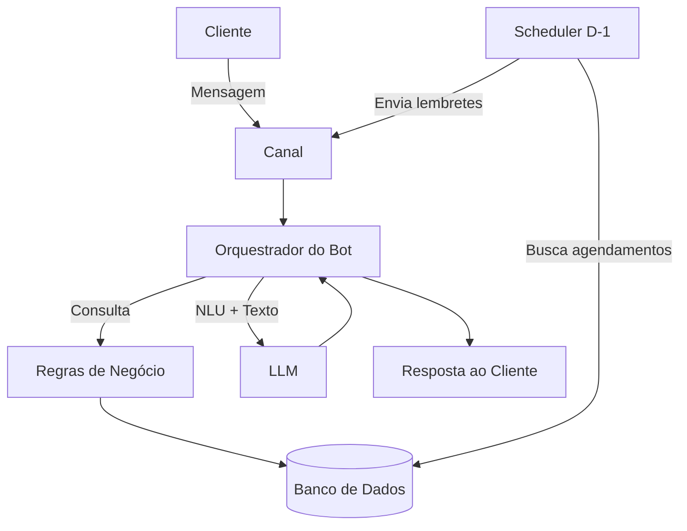

# Documentação do Agente

## Caso de Uso

### Problema
> Qual problema operacional o agente resolve e qual o impacto no negócio?

A barbearia recebe muitas mensagens repetidas diariamente (preço, endereço, horários, serviços) e perde tempo com agendamentos manuais. Isso gera atrasos no atendimento, conflitos de horário, dificuldade para organizar a agenda e faltas (no-shows), o que aumenta horários ociosos e diminui o faturamento.

### Solução
> Como o agente resolve esse problema de forma proativa?

O agente atende clientes automaticamente, respondendo dúvidas frequentes e realizando agendamentos com base na disponibilidade real da barbearia. Ele confirma os dados do cliente, permite escolher entre 2 barbeiros e registra o horário no sistema. Para reduzir faltas, o agente envia um lembrete automático 1 dia antes solicitando confirmação ou cancelamento, liberando horários rapidamente quando necessário.

### Público-Alvo
> Quem vai usar esse agente?

Clientes da barbearia: para tirar dúvidas e agendar horários com rapidez.

Equipe/gerência: para reduzir trabalho manual, evitar conflitos e aumentar eficiência da agenda.

---

## Persona e Tom de Voz

### Nome do Agente
BIA Barber (Barber Intelligence Assistant)

### Personalidade
> Como o agente se comporta? (ex: consultivo, direto, educativo)

O agente é educado, rápido, objetivo e prestativo. Ele conduz a conversa com perguntas curtas, confirma informações antes de registrar e evita respostas longas. Atua como uma "secretária digital" da barbearia.

### Tom de Comunicação
> Formal, informal, técnico, acessível?

Informal e acessível

Linguagem natural (sem parecer robô)

Emojis moderados (✂️📅✅), apenas quando fizer sentido

Respostas diretas e organizadas

### Exemplos de Linguagem

**Saudação:**
"Fala! 👋 Quer agendar um horário hoje?"

**Confirmação:**
"Fechado ✅ Seu horário ficou reservado!"

**Erro/Limitação:**
"Nesse horário não tenho vaga 😕 Quer que eu veja 15:30 ou 16:00?"

---

## Arquitetura

### Diagrama

### Componentes

| Componente | Descrição |
|------------|-----------|
| Interface | Webchat simples para MVP (HTML/JS ou React) + Adapter futuro para WhatsApp Cloud API |
| LLM | Modelo de linguagem (ex: GPT-4o-mini / GPT-4.1-mini) para interpretar intenções e responder naturalmente |
| Base de Conhecimento | Arquivo JSON/YAML com regras da barbearia: horários, serviços, duração e mensagens padrão |
| Regras de Agendamento | Valida horário, barbeiro, duração, expediente (09:00–19:00), almoço e tolerância |
| Banco de Dados | SQLite (MVP) para armazenar clientes, barbeiros, serviços e agendamentos |
| Scheduler D-1 | Rotina diária (APScheduler/Cron) que envia lembrete 1 dia antes com CONFIRMAR/CANCELAR |
| Validação | Regras rígidas: não inventar horários, confirmar dados antes de salvar, lidar com exceções |

---

### Estado da conversa

 |O agente opera com estados explícitos, evitando ambiguidades:
 |IDLE
 |FAQ
 |AGENDANDO_SERVICO
 |AGENDANDO_BARBEIRO
 |AGENDANDO_DATA
 |AGENDANDO_HORA
 |CONFIRMACAO
 |FINALIZADO
 |FALLBACK_HUMANO

> A mudança de estado é controlada pelo orquestrador, nunca pelo LLM diretamente.

---

## Segurança e Anti-Alucinação

> Estratégias Adotadas
|O agente só responde sobre horários e serviços com base na base de conhecimento.
|O agente nunca inventa disponibilidade: sempre consulta o banco.
|O agente confirma serviço, data, hora, barbeiro e cliente antes de registrar.
|O agente respeita regras fixas de funcionamento.
|Quando não sabe ou foge do escopo, redireciona para humano.

> Limitações Declaradas
|Não processa pagamentos.
|Não agenda fora do horário de funcionamento.
|Não garante reserva sem confirmação explícita.
|Não envia mensagens promocionais sem autorização.
|Não solicita motivo de cancelamento automaticamente.
|Casos complexos são encaminhados para atendimento humano.

---

### Estratégias Adotadas

- [x] O agente só responde sobre horários/serviços com base na base de conhecimento (JSON/YAML).
- [x] O agente nunca inventa disponibilidade: ele sempre consulta o banco de dados antes de oferecer horários.
- [x] O agente confirma os dados antes de registrar: serviço + data + hora + barbeiro + nome/contato.
- [x] O agente respeita regras fixas: expediente, almoço, duração do serviço e bloqueios.
- [x] Quando não sabe, admite e redireciona para atendimento humano.

### Limitações Declaradas
> O que o agente NÃO faz?

- Não processa pagamentos e não realiza cobrança.
- Não faz atendimento médico/dermatológico (ex.: problemas de pele).
- Não agenda fora do horário de funcionamento (09:00 às 19:00) ou durante bloqueios.
- Não garante reserva sem confirmação explícita do cliente.
- Não envia mensagens de marketing/promoção sem autorização do cliente.
- Não solicita motivo de cancelamento automaticamente (para evitar mensagens extras e custos no WhatsApp).
- Em casos complexos (reclamações, exceções, descontos), redireciona para humano.